  
  
  
  <h2> Hi there👋 I’m a Senior Blockchian Engineer! </h2>

  
    
  
  - 🔭 I’m currently open to a new Job
  
  - 🌱 I’m mostly working on **Qubic Network**.
  
  - 👨‍💻 All of my projects are available at [Aleriado's Github](http://github.com/aleriado)
  
  - 💬 Ask me about **Rust, Solidity, Python, React/Next.js and Typescript with Tailwinds**
  
  - 📫 How to reach me **naritadaiki3@gmail.com**
  
  - 📄 Know about [my experiences](http://#resume)
  
  - ⚡ Fun fact **I think I'm funny**

  <picture>
    <source media="(prefers-color-scheme: dark)" srcset="https://github.com/monkey531/assets/blob/main/github-contribution-grid-snake-dark.svg" />
    <source media="(prefers-color-scheme: light)" srcset="https://github.com/monkey531/assets/blob/main/github-contribution-grid-snake-light.svg" />
    
  </picture>

